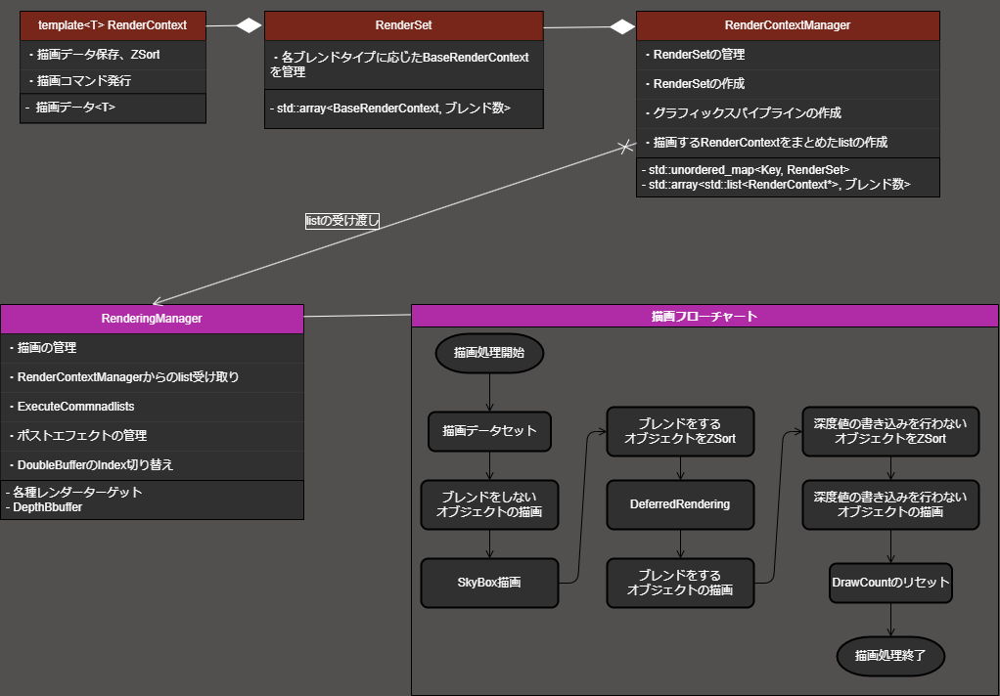
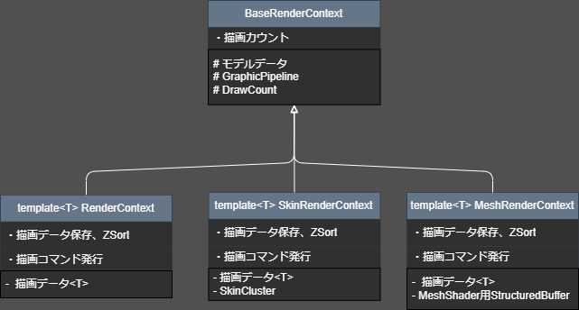
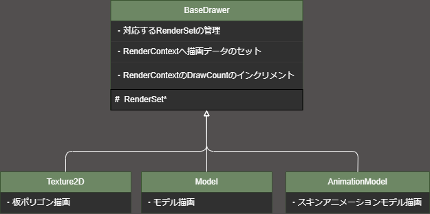

Windows :  
* 
* 
* 

Windows SDK : 10.0.26100.0  
DirectX : 12  
推奨グラフィックボード : GeForce RTX3060 laptop以上(GTXではMeshShaderが利用できずパフォーマンスに影響が出ますが、実行はできます)  

 
  

# LambEngine
## 水の描画に特化したエンジン
* DeferredRendering
* ZSort
* 水面のシミュレーション
* ポストエフェクト
* MeshShaderとVertexShaderの切り替え

## 水概要
制作期間 : 11ヶ月(2023年12月～現在)
* 水の作成変遷
  * PerlinNoiseからHeightMapを作成、NormalMapに変換して細かい波の表現しています。
  
  * 水を透過させて水面下に484個のモデルを配置。DoubleBufferとMeshShaderで描画を最適化しています。
  
  * 水を描画する際に歪みの情報をPerlinNoiseで生成。それを元にポストエフェクトで歪ませています。
  
  * 歪みを入れたタイトル
    
  * 最近実装した波
  
    * ポリゴンを分割した頂点で波を表現しています。
    

* 参考サイト、参考書籍
  * https://blog.natade.net/2015/12/13/secondlife-water-make/
  * https://www.klab.com/jp/blog/tech/2021/unitydeferredrendering.html
  * [Tonemap参考](https://technorgb.blogspot.com/2018/02/hyperbola-tone-mapping.html)
  * [DirectX12の魔導書](https://www.amazon.co.jp/DirectX-12%E3%81%AE%E9%AD%94%E5%B0%8E%E6%9B%B8-3D%E3%83%AC%E3%83%B3%E3%83%80%E3%83%AA%E3%83%B3%E3%82%B0%E3%81%AE%E5%9F%BA%E7%A4%8E%E3%81%8B%E3%82%89MMD%E3%83%A2%E3%83%87%E3%83%AB%E3%82%92%E8%B8%8A%E3%82%89%E3%81%9B%E3%82%8B%E3%81%BE%E3%81%A7-%E5%B7%9D%E9%87%8E-%E7%AB%9C%E4%B8%80/dp/4798161934)
  * [Direct3D12 ゲームグラフィックス実践ガイド](https://www.amazon.co.jp/Direct3D12-%E3%82%B2%E3%83%BC%E3%83%A0%E3%82%B0%E3%83%A9%E3%83%95%E3%82%A3%E3%83%83%E3%82%AF%E3%82%B9%E5%AE%9F%E8%B7%B5%E3%82%AC%E3%82%A4%E3%83%89-Pocol/dp/4297123657/ref=pd_vtp_d_sccl_2_3/356-7695606-0800967?pd_rd_w=Gc5BF&content-id=amzn1.sym.7f9fddb9-42c4-4d60-8284-9aaab79d2e8c&pf_rd_p=7f9fddb9-42c4-4d60-8284-9aaab79d2e8c&pf_rd_r=7HCH7001J68JEWWG5MKP&pd_rd_wg=l4HfR&pd_rd_r=daaa72c7-cdd2-4bf4-9609-732e706e24a0&pd_rd_i=4297123657&psc=1)
  * [大気散乱](https://karanokan.info/2019/09/16/post-3352/)

## エンジンで最もこだわっているところ
* 描画は[RenderingManager](https://github.com/KikutaniTakuma/LambEngine/tree/master/Projects/LambEngine/Engine/Graphics/RenderingManager)で管理してます。
  * RenderContextの情報をもとに実際に描画コマンドを発行します
  * レンダーターゲットの設定、ポストエフェクト等もここで行います
  * ZSortをRenderingManagerのDraw関数でしています

  

* 描画情報の格納を[RenderContext](https://github.com/KikutaniTakuma/LambEngine/tree/master/Projects/LambEngine/Engine/Graphics/RenderContextManager/RenderContext)でしています
  * 描画情報を保持するのとDrawCountを行います。
  * RenderContextをtemplate化してshader側との対応を最小限にして共通化しています。

  

* 描画情報を[Drawer](https://github.com/KikutaniTakuma/LambEngine/tree/master/Projects/LambEngine/Drawer)で積んでいます
  * クライアント側から直接描画データをセットをして使います。
  * 各Shaderや用途に合わせてBaseDrawerを継承して特化させています。

  

## 外部ライブラリ
- [Projects/externals](https://github.com/KikutaniTakuma/LambEngine/tree/master/Projects/externals)
  - [DirectXMesh](https://github.com/microsoft/DirectXMesh)
  - [DirectXTK12](https://github.com/microsoft/DirectXTK12)
  - [DirectXTex](https://github.com/microsoft/DirectXTex)
  - [ImGui](https://github.com/ocornut/imgui/tree/docking)
  - [ImGuizmo](https://github.com/CedricGuillemet/ImGuizmo)
  - [ImPlot](https://github.com/epezent/implot)
  - [assimp](https://github.com/assimp/assimp)
  - [nlohmann](https://github.com/nlohmann/json)
---

 
  

# アプリケーション
## ゲーム : 笹舟大航海
* ジャンル : シミュレーション
* 作成期間 : チーム2ヶ月(2023年12月～2024年2月)+個人9ヶ月(2024年6月～現在)
* 制作人数 : 3人(プランナー1人、プログラマー2人)
* 担当箇所 : 水、空、タイトル、描画エンジン
## ゲーム画面
https://youtu.be/W3fc-wBp30Y

## チームメンバーが書いたコード
[Projects/Game/Src/GameExternals](https://github.com/KikutaniTakuma/LambEngine/tree/master/Projects/Game/Src/GameExternals)
* ゲームの部分のコードはチームメンバーが書いています
* 各シーンの基底クラスや大元は自分で書きました
* 一部書き直したりしています
---
