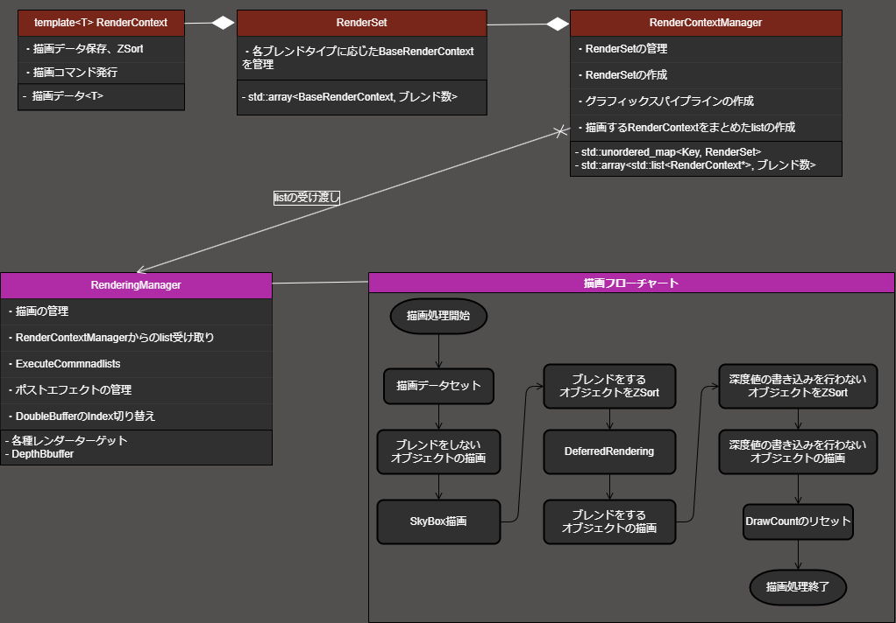
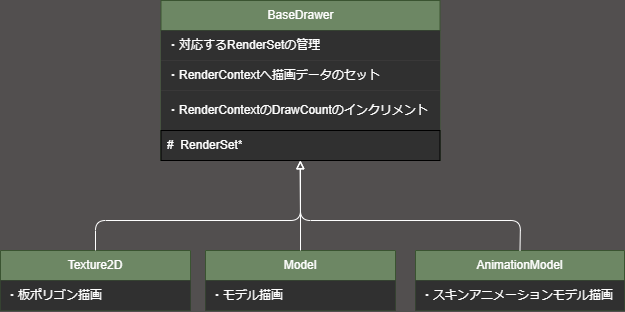

# LambEngine
## 水の描画に特化したエンジン
* DeferredRendering
* ZSort
* 水面のシミュレーション
* ポストエフェクト
* MeshShaderとVertexShaderの切り替え

## 水概要
制作期間 : 11ヶ月
* PerlinNoiseからHeightMapを作成、NormalMapに変換して細かい波の表現しています。

 

* 水を透過させて水面下に484個のモデルを配置。DoubleBufferとMeshShaderで描画を最適化しています。

 

* 水を描画する際に歪みの情報をPerlinNoiseで生成。それを元にポストエフェクトで歪ませています。

## エンジンで最もこだわっているところ
* 描画は[RenderingManager](https://github.com/KikutaniTakuma/LambEngine/tree/master/Projects/LambEngine/Engine/Graphics/RenderingManager)で管理してます。
  * RenderContextの情報をもとに実際に描画コマンドを発行します
  * レンダーターゲットの設定、ポストエフェクト等もここで行います
  * ZSortをRenderingManagerのDraw関数でしています

  

* 描画情報の格納を[RenderContext](https://github.com/KikutaniTakuma/LambEngine/tree/master/Projects/LambEngine/Engine/Graphics/RenderContextManager/RenderContext)でしています
  * RenderContextをtemplate化してshader側との対応を最小限にして共通化しています。

  

* 描画情報を[Drawer](https://github.com/KikutaniTakuma/LambEngine/tree/master/Projects/LambEngine/Drawer)で積んでいます
  * 各Shaderや用途に合わせてBaseDrawerを継承して特化させています。

  

## 外部ライブラリ
- [Projects/externals](https://github.com/KikutaniTakuma/LambEngine/tree/master/Projects/externals)
  - [DirectXMesh](https://github.com/microsoft/DirectXMesh)
  - [DirectXTK12](https://github.com/microsoft/DirectXTK12)
  - [DirectXTex](https://github.com/microsoft/DirectXTex)
  - [ImGui](https://github.com/ocornut/imgui/tree/docking)
  - [ImGuizmo](https://github.com/CedricGuillemet/ImGuizmo)
  - [assimp](https://github.com/assimp/assimp)
  - [nlohmann](https://github.com/nlohmann/json)
---

 
  

# アプリケーション
## ゲーム : 笹舟大航海
* ジャンル : シミュレーション
* 作成期間 : 2ヶ月
* 制作人数 : 3人(プランナー1人、プログラマー2人)
* 担当箇所 : 水、空、タイトル、描画エンジン
## ゲーム画面

## チームメンバーが書いたコード
[Projects/Game/Src/GameExternals](https://github.com/KikutaniTakuma/LambEngine/tree/master/Projects/Game/Src/GameExternals)
* ゲームの部分のコードはチームメンバーが書いています
* 各シーンの基底クラスや大元は自分で書きました
* 一部書き直したりしています
---
